# ADR: deterministic TCGA data foundation

**Status:** accepted (2026-09-20)

```mermaid
flowchart LR
  GDC[GDC API] --> Adapter[GDC Adapter] --> Snapshot[Frozen Snapshot]
  Snapshot --> Align[Coverage / Alignment] --> Transfer[official gdc-client]
  Transfer --> Objects[SHA-256 Object Store] --> Parquet[Canonical Parquet]
  Parquet --> Query[DuckDB / Polars] --> Stats[Deterministic Statistics] --> Finding[Finding]
```

## Decisions

* The immutable logical snapshot contains identity Parquet tables, exact open-access filter, manifest,
  coverage, and provenance. Its scientific content hash excludes creation time.
* Snapshot identity retains complete file-to-case/sample/aliquot links rather than only aggregate ID sets.
  Publication is atomic and immutable; a completeness marker authenticates every required artifact.
* PostgreSQL stores durable metadata/job state, never genome-scale matrices. S3/MinIO stores immutable
  SHA-256 addressed bytes; transfer cache is separate. Parquet plus DuckDB/Polars is analytical storage.
* Coverage is computed independently per case and modality. Every analysis performs an exact
  case/sample/gene join and records eligible IDs, missing count and fraction.
* The default TCGA policy accepts `Primary Tumor`, excludes normal/recurrent/metastatic samples, and
  retains multiple qualifying samples in stable UUID order. Downstream analysis must resolve the
  visible ambiguity; CancerJev never chooses the first response.
* Harmonized output is consumed as supplied by GDC. CancerJev does not rerun RNA/DNA harmonization.
* GDC metadata responses are streamed into a configurable bounded buffer before JSON decoding. The
  ceiling applies even when `Content-Length` is absent or wrong, and deterministic oversize responses are
  not retried. Public project `size` is a caller result limit, not an instruction to exhaust all pages.

## Canonical measurement rules

Expression always carries `measurement_type`; counts and normalized values cannot be combined without
an explicit transformation. Gene CNV and segment CNV have separate schemas. Mutation rows preserve SSM
and source-file identity. No missing value is imputed. Association is not described as causal.

Genome-wide CNV↔RNA uses Pearson correlation with a 95% confidence interval and centralized
Benjamini-Hochberg FDR. Mutation↔RNA uses Welch's t-test and mean difference. RNA variance is sample
variance and outliers use median absolute deviation. Survival uses Kaplan-Meier. Findings retain exact
eligible identities, effect, p/q, missingness, analysis version, object hashes, and deterministic result hash.
