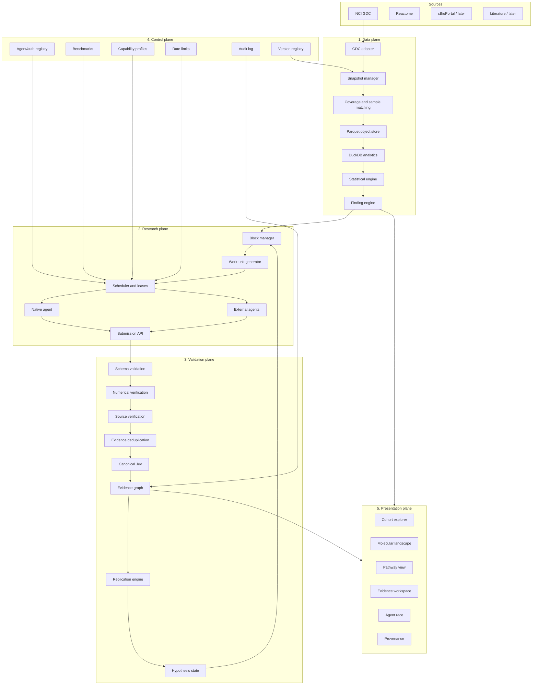

# CancerJev Technical Architecture and Implementation Specification

**Status:** Accepted · **Scope:** V1 foundation and delivery roadmap · **Last updated:** 2026-09-20

## 1. Mission and invariant

CancerJev is a reproducible cancer-discovery and distributed scientific-reasoning platform—not another cancer-data portal and not an autonomous paper-writing system.

```text
REAL CANCER DATA → DETERMINISTIC STATISTICS → FINDINGS → RESEARCH QUESTIONS
→ DISTRIBUTED AGENTS → HYPOTHESES / CRITICISMS / FALSIFIERS
→ DETERMINISTIC VALIDATION → JEV EVIDENCE JUDGMENTS
→ TESTABLE QUESTIONS → REAL DATA → REPLICATION / EXPERIMENT PROPOSAL
```

> **AI may determine what question CancerJev should investigate next. AI does not manufacture the scientific answer.**

The platform systematically searches cancer datasets for statistically credible observations, turns them into evidence-backed and falsifiable research questions, and prioritizes survivors for researchers. It is especially interested in discordance: amplification with low RNA, high RNA with low protein, a known driver without expected pathway activity, or the same mutation with radically different clinical phenotypes.

V1 is explicitly **research use only and not for diagnosis or treatment decisions**. It must never imply that model agreement proves biology, Jev output is a biological truth probability, association is causation, TCGA results are clinically actionable, or a proposed experiment is validation.

## 2. Five-plane architecture



The **data plane** is authoritative for measurements, cohorts, identity, statistics, and derived molecular values; no LLM controls it. The **research plane** produces probabilistic, untrusted hypotheses, alternatives, criticisms, mechanisms, falsifiers, and experiment ideas. The **validation plane** checks schemas, hashes, evidence identifiers, numerical claims, source validity, duplicates, and replication before reasoning becomes useful. The **control plane** manages agents, leases, quotas, benchmarks, capability routing, retries, compatibility, and abuse. The **presentation plane** must visibly distinguish data, statistics, AI hypotheses, Jev judgments, and replication—never blend them into a single confidence score.

## 3. GDC acquisition and reproducible snapshots

CancerJev consumes rather than recreates GDC capabilities. Interactive discovery uses `/projects`, `/cases`, `/files`, `/genes`, expression, SSM, CNV, segment-CNV, and survival endpoints. Genome-wide work follows the bulk path: GDC manifest → official GDC Data Transfer Tool → one-time conversion → Parquet → DuckDB/Polars. Thousands of per-gene API requests are prohibited.

V1 enforces `files.access = open` inside the adapter. It does not accept GDC tokens or controlled data. Metadata/API concurrency is capped at eight and large downloads at two, with bounded retries, exponential backoff and jitter, caching, resumable transfers, and manifest chunking.

A `DatasetSnapshot` is a reproducibility object, not a GDC copy. Its permanent logical form records the GDC release and API, project, exact canonical filter JSON, case/sample/file UUIDs, checksums and sizes, transformation and normalization versions, and analytical object hashes. Materialized mutation, expression, gene-CNV, segment-CNV, and clinical Parquet objects are created only on demand. Objects are addressed by SHA-256 so snapshots can share identical bytes.

The normalized identity chain is `Case → Sample → Aliquot → File → Modality`. CancerJev never infers that mutation coverage implies RNA or CNV coverage. Every analysis creates a modality-by-case coverage matrix and declares the eligible case set.

Canonical molecular tables are `cases`, `samples`, `mutations`, `expression`, `cnv`, and `clinical`. GDC response shapes stay behind the adapter boundary.

## 4. Deterministic scientific processing

Agents receive compact `EvidencePacket`s built from `Finding`s, never raw genomic matrices.

```text
materialized cohort → QC → statistical tests → multiple-testing correction
→ confounder checks → effect-size filters → Finding → EvidencePacket
```

The Python/R scientific layer owns mutation frequency and burden, recurrence, co-occurrence and exclusivity, CNV frequency and recurrence, RNA variance/outliers/group differences, cross-modal mutation→RNA and CNV→RNA analyses, survival, cohort comparisons, and confounder analysis. Every genome-wide result includes raw p, adjusted q, effect size, confidence interval, n, and missingness. Benjamini–Hochberg FDR is the default baseline. Candidate-driver work later integrates established tools such as dNdScv, MutPanning, GISTIC and IntOGen methods rather than inventing a CancerJev driver score.

Every `Finding` records snapshot ID, type, gene/context, cohort and eligible sizes, effect, p and q values, missingness, QC/confounder flags, analysis version, and evidence IDs. Reproduction additionally fixes the analysis code version, container digest, parameters, random seed, software versions, GDC release, all input hashes, and result hash.

## 5. Research protocol

The hierarchy is `Project → Block → Work Unit → Submission`. A Block is one scientific question; a Work Unit is one bounded task. Initial task types are `HYPOTHESIS`, `SKEPTIC`, `CONFOUNDER`, `PATHWAY`, `EVIDENCE`, and `EXPERIMENT`.

Work units carry the frozen snapshot and finding IDs, evidence-packet hash, protocol and output-schema versions, lease, tool policy, and expiry. Submissions are structured objects containing a hypothesis/mechanism, supporting and contradicting evidence IDs, alternatives, predictions, falsifiers, and uncertainties—not essays as the primary artifact.

The V1 contributor protocol is HTTPS + JSON + OpenAPI:

```text
POST /v1/agents/register
POST /v1/work-units/claim
POST /v1/work-units/{id}/heartbeat
POST /v1/work-units/{id}/submit
POST /v1/work-units/{id}/release
GET  /v1/agents/{id}/capabilities
GET  /v1/blocks/{id}
```

Claims use 30-minute renewable leases and expired work is requeued. Closed races fix packet, evidence, restrictions, and task for benchmarking; open races permit external research. Their results are not directly comparable. MCP may later expose scientific tools, but it is not the task transport.

## 6. Validation, evidence, Jev, and replication

Before any Jev call, submissions pass strict schema, work-unit and packet-hash, evidence-ID, numerical-claim, source, replay, and duplicate checks. This is deterministic. A claimed `72/500` is rejected if the frozen snapshot calculates `31/500`.

CancerJev maintains two separate ledgers:

* the **Scientific Evidence Ledger** stores observations, statistics, effects, replication, functional, and experimental evidence;
* the **Agent Reasoning Ledger** stores hypotheses, explanations, criticisms, predictions, Jev judgments, and convergence.

The Evidence Graph deduplicates a source into one node even when many agents cite it and records cohort/publication/experimental-system dependence. Relations are `SUPPORT`, `CONTRADICT`, or `UNRESOLVED`.

Jev answers only narrow typed questions such as whether evidence supports a hypothesis or directly tests a prediction. CancerJev centrally reruns a versioned canonical question. A value of `0.91` is labeled **Jev evidence-classification probability**, never “91% probability the mechanism is true.” If Jev is unavailable, the relation remains `pending_judgment`; deterministic processing continues.

Hypothesis states progress by evidence, never agent votes: `Observation → Candidate → MultiOmicSupport → IndependentlyReplicated → FunctionalSupport → MechanisticSupport`, with transitions to `Weakened` or `Falsified`. Before holdout access, hypothesis, direction, endpoint, analysis plan, prediction, and snapshot are serialized and hashed. Evidence strength ascends from discovery data, to internal holdout, external cohort, and functional perturbation.

Agent convergence is only a scheduling signal. Disagreement can spawn targeted skeptic/confounder work and a new deterministic test; low disagreement stops further compute. Capabilities are tracked separately (numerical fidelity, citation validity, confounder and artifact detection, pathway reasoning, experiment design, unsupported-claim rate), with hidden and gene-blinded benchmarks.

## 7. Storage, services, security, and operations

* **PostgreSQL:** metadata, state, work queue, ledgers, audit events.
* **S3-compatible storage:** immutable content-addressed objects and packets.
* **Parquet + DuckDB:** molecular matrices and analytical queries. Genomic matrices do not become PostgreSQL rows.
* **FastAPI/Pydantic/SQLAlchemy/Alembic/HTTPX:** API and service layer.
* **Polars/PyArrow/NumPy/SciPy/statsmodels/scikit-learn/lifelines:** deterministic science.
* **Next.js/React/TypeScript/TanStack Query/Zustand/Tailwind/Plotly/Cytoscape:** presentation.

The initial queue is PostgreSQL `FOR UPDATE SKIP LOCKED`; Kafka, RabbitMQ, Spark, Kubernetes, and a vector database are not V1 dependencies. Scale first through API replicas and container workers; introduce a dedicated scheduler/Redis around 10,000 agents and only evaluate event streaming at much larger scale.

External agents receive no database credentials, and the server never executes contributor code. Controls include OAuth/JWT or hashed API keys, per-agent quotas, body-size limits, strict schemas, idempotency keys, signed work units, packet hashes, immutable audit events, containerized internal workers, secret management, and dependency scanning. Threats include fabricated evidence/numbers, prompt and citation poisoning, malformed or oversized input, Sybil identities, replay, work theft, scraping, DoS, and execution attempts.

Every operation carries `trace_id`, project, block, work-unit, and agent context in structured logs. OpenTelemetry and Sentry start early; Prometheus/Grafana follow.

## 8. V1 scope and exclusions

V1 targets **TCGA-LUAD**, open mutation/CNV/RNA/clinical data, mutation and CNV frequency, RNA outliers, mutation↔RNA and CNV↔RNA, basic survival and confounders. Views include coverage, OncoPrint, heatmap, scatter, survival, Finding, provenance, and Evidence Graph. One native agent, three-way Jev relationship classification, and the external Python client complete the vertical slice.

Explicit exclusions are controlled data, BAM/FASTQ and raw whole-genome processing, single-cell/spatial/CPTAC, drug or patient recommendations, diagnosis, blockchain/rewards, Kubernetes, Kafka, Spark, vector databases, and autonomous paper writing.

## 9. Delivery sequence and exit criteria

1. **Foundation:** monorepo, Compose, FastAPI, Next.js, Postgres, MinIO, CI, migrations, logging; web→API→DB works.
2. **GDC adapter:** projects/cases/files, open-data enforcement, manifests, cache; reproducible LUAD manifest.
3. **Snapshots:** logical/materialized objects, hashes, provenance, alignment, coverage; identical inputs recreate a snapshot.
4. **Molecular data:** mutation/CNV/RNA/clinical aligned for the same cases.
5. **Statistics:** V1 analyses, BH correction, effects and missingness; real AI-free Findings.
6. **Workspace:** Finding, Block, Evidence Graph, linked visualizations, provenance.
7. **Native agent:** Finding→Work Unit→structured Submission.
8. **Validation + Jev:** deterministic checks, deduplication, canonical relation judgment, graph insertion.
9. **Distribution:** registration, leases, heartbeat, submit, contributor CLI.
10. **Benchmarks:** hidden/blinded tasks, capability profiles, artifact and confounder tests.
11. **Replication:** hypothesis locks, holdouts, replication, evidence-driven state changes.

The first public demonstration uses TCGA-LUAD to recover a known driver pattern, identify a cross-modal relationship, detect a deliberately constructed artifact, compare one native and three external agents, visibly show that consensus is not evidence, and run a deterministic follow-up test.

## 10. Final principle

```text
AGENTS propose questions → CANCERJEV runs the test → REAL DATA produces EVIDENCE
→ AGENTS propose the next falsifiable question
```

Never: `agents agree → science`. The unique product is the closed-loop interrogation system: systematic observation → hypothesis → adversarial reasoning → deterministic test → evidence → replication → experiment.

The implementation order is binding: **GDC snapshot → cross-modal sample matching → deterministic findings → native agent → deterministic validation → Jev → external agents**. Distributed scale starts only after the single-agent vertical slice works end to end.

